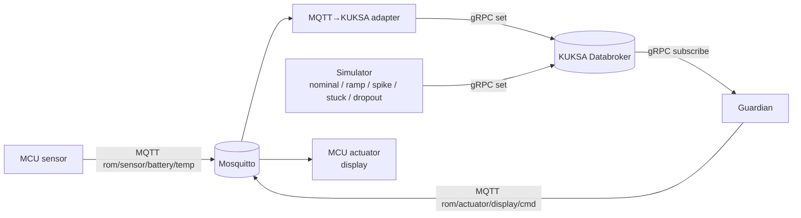

<!-- Made with Claude (Claude Code, Anthropic) -->
# RoM — MVP plan (Doctor Whodunit)

**Goal for the next ~4–5 hours:** one complete flow from sensor to display, running locally (no containers for our own services yet).



**Out of scope for the MVP (on purpose):** uProtocol, Ankaios, DFM/OpenSOVD, evidence collector, containers for our services. We write the code so these are easy to add later (see "Rules that save time later").

---

## 0. Phase 0 — alignment + infrastructure (everyone together, T+0:00 → T+0:30)

Done directly on `main` (one small commit), so all 4 branches start from the same contract.

### 0.1 Contracts — file `contracts/README.md`

**VSS signal (KUKSA):**

| Signal | Type | Unit | Written by | Read by |
|---|---|---|---|---|
| `Vehicle.Powertrain.TractionBattery.Temperature.Max` | float | °C | adapter **or** simulator | guardian |

> First task in Phase 0: verify that the databroker knows this path (`getValue` from `kuksa-client`). If it doesn't exist in the loaded VSS, use `...Temperature.Average` and update this file.

**MQTT topics:**

| Topic | Direction | QoS | Retain | Payload |
|---|---|---|---|---|
| `rom/sensor/battery/temp` | MCU sensor → adapter | 0 | no | `{"device_id":"sensor-01","seq":42,"ts_ms":1730000000000,"temp_c":31.5}` |
| `rom/sensor/battery/status` | MCU sensor (LWT) | 1 | yes | `"online"` / `"offline"` |
| `rom/actuator/display/cmd` | guardian → MCU display | 1 | yes | `{"state":"WARNING","temp_c":47.2,"reason":"TEMP_ABOVE_WARN","seq":7,"ts_ms":1730000000000}` |

**Guardian states (`state`):** `CLEAR` · `MONITORING` · `WARNING` · `CRITICAL` · `SENSOR_FAULT`

**Thresholds (initial values, configurable via env):**

| Parameter | Value |
|---|---|
| `WARN_C` | 45.0 °C |
| `CRIT_C` | 55.0 °C |
| `HYST_C` | 2.0 °C (leave WARNING only below 43 °C) |
| `STALE_MS` | 2000 ms without a new value → `SENSOR_FAULT` (reason `STALE`) |
| `STUCK_S` | 10 s of identical values → `SENSOR_FAULT` (reason `STUCK`) — *stretch* |
| Plausible range | −40 … 150 °C, outside of it → `SENSOR_FAULT` (reason `OUT_OF_RANGE`) |

**Shared env variables (never hardcode IPs):**
`MQTT_HOST` (default `localhost`), `MQTT_PORT` (`1883`), `KUKSA_HOST` (`127.0.0.1`), `KUKSA_PORT` (`55555`)

### 0.2 Repo structure

```text
RoM/
  contracts/README.md          # the contracts above — single source of truth
  infra/docker-compose.yml     # mosquitto + kuksa-databroker
  adapter/                     # branch feature/mqtt-kuksa-adapter
  simulator/                   # branch feature/simulator
  guardian/                    # branch feature/guardian
  firmware/sensor/  firmware/display/   # branch feature/firmware
  scripts/run_mvp.sh           # starts everything in order (added at the end)
  logs/                        # .gitignore
```

### 0.3 Infrastructure — `infra/docker-compose.yml` (Person B, ~10 min)

```yaml
services:
  mosquitto:
    image: eclipse-mosquitto:2
    command: mosquitto -c /mosquitto-no-auth.conf   # anonymous access, port 1883 on all interfaces
    ports: ["1883:1883"]
  databroker:
    image: ghcr.io/eclipse-kuksa/kuksa-databroker:latest
    command: --insecure
    ports: ["55555:55555"]
```

Start: `docker compose -f infra/docker-compose.yml up` (on Fedora: `podman compose ...`).

**Network for the MCUs:** everything (the laptop running the broker + both MCUs) on the **same Wi-Fi / hotspot**. Write down the broker laptop's IP right away and open port 1883 in the firewall (`sudo firewall-cmd --add-port=1883/tcp`).

**Python environment (everyone):** Python 3.10+, `pip install kuksa-client paho-mqtt pytest`.

✅ **End of Phase 0:** `contracts/README.md` + `infra/` are on `main`, everyone has pulled `main` and created their branch.

---

## 1. Work split by branch

Rules for all branches:
- Branches are created from `main` after Phase 0. Merging goes **through a PR**, with **one reviewer** from the team (points for *Development Methods*).
- Commit messages: `feat(guardian): ...`, `fix(adapter): ...`, `docs: ...`.
- Each component has its own `README.md` covering: how to run it, which env variables it uses, how to test it standalone.
- Each component logs **JSON lines** to stdout (`{"ts_ms":..., "component":"guardian", "event":"state_change", ...}`) — this is the raw material for the evidence collector later.

---

### Branch 1 — `feature/firmware` · Person A · MCU sensor + MCU display

**Folder:** `firmware/sensor/`, `firmware/display/`

**Tasks — sensor:**
1. Wi-Fi connection + MQTT client to `MQTT_HOST` (laptop IP, in a config header, not in the code).
2. Read temperature (real sensor; if there is none — a potentiometer or a hardcoded ramp on the MCU).
3. Publish to `rom/sensor/battery/temp` every **500 ms**, JSON exactly per the contract, `seq` incremented by 1.
4. LWT on `rom/sensor/battery/status` = `"offline"`, after connecting publish `"online"` (retain).
5. Reconnect loop for Wi-Fi and MQTT.

**Tasks — display:**
1. Subscribe to `rom/actuator/display/cmd`.
2. Show: large `state` + `temp_c` + `reason`. Color/icon per state (CLEAR/MONITORING green, WARNING yellow, CRITICAL red/blinking, SENSOR_FAULT purple).
3. *Stretch:* if no message for > 3 s → show `NO GUARDIAN` (guardian is dead = warning chain disarmed — tells the challenge's story directly).

**Testing without the rest of the system:**
```bash
mosquitto_sub -h <IP> -t 'rom/#' -v                       # see what the sensor sends
mosquitto_pub -h <IP> -t rom/actuator/display/cmd -r \
  -m '{"state":"WARNING","temp_c":47.2,"reason":"TEMP_ABOVE_WARN","seq":1,"ts_ms":0}'
```

**Definition of Done:**
- [ ] `mosquitto_sub` shows valid JSON from the sensor 2×/s
- [ ] A manual `mosquitto_pub` changes the display within < 1 s
- [ ] Turning off the sensor → `status` switches to `offline`

---

### Branch 2 — `feature/mqtt-kuksa-adapter` · Person B · MQTT → KUKSA

**Folder:** `adapter/` (`mqtt_kuksa_adapter.py`, `requirements.txt`, `README.md`)
**First:** `infra/docker-compose.yml` (Phase 0).

**Tasks:**
1. Subscribe to `rom/sensor/battery/temp` (paho-mqtt, auto-reconnect).
2. Parsing + validation: valid JSON, `temp_c` is a number. Invalid message → log `{"event":"rejected", "reason":...}`, **not** written to the databroker.
3. Write to KUKSA:
   ```python
   from kuksa_client.grpc import VSSClient, Datapoint
   with VSSClient(KUKSA_HOST, KUKSA_PORT) as kc:
       kc.set_current_values({"Vehicle.Powertrain.TractionBattery.Temperature.Max": Datapoint(temp_c)})
   ```
   One persistent KUKSA connection, not a new one per message.
4. Mapping (topic → VSS path, scale/offset) in a small table/dict at the top of the file or in `adapter/mapping.json` — not scattered across the code.
5. Log per message: `seq`, `temp_c`, latency (`now - ts_ms`), total received/rejected.
6. Detect gaps in `seq` (lost messages) → log `{"event":"seq_gap", ...}` — a free first transport-fault detector.

**Testing without the MCU:**
```bash
mosquitto_pub -h localhost -t rom/sensor/battery/temp \
  -m '{"device_id":"fake","seq":1,"ts_ms":0,"temp_c":50.0}'
kuksa-client grpc://127.0.0.1:55555        # then: getValue Vehicle.Powertrain.TractionBattery.Temperature.Max
```

**Definition of Done:**
- [ ] A manual `mosquitto_pub` → value visible in `kuksa-client`
- [ ] Malformed JSON doesn't crash the adapter
- [ ] Restarting Mosquitto or the databroker → the adapter recovers on its own

---

### Branch 3 — `feature/simulator` · Person C · Simulator → KUKSA

**Folder:** `simulator/` (`simulator.py`, `README.md`)

**CLI:**
```bash
python simulator/simulator.py --mode ramp --hz 2 --duration 60 --seed 42
```

**Modes (at least the first three, the rest in order):**

| `--mode` | Behavior | What the Guardian should do |
|---|---|---|
| `nominal` | 30 °C ± 1 noise | `MONITORING` |
| `ramp` | 30 °C → 70 °C, +0.5 °C/s | `WARNING` at 45, `CRITICAL` at 55 |
| `dropout` | nominal for 10 s, then **stops sending** | `SENSOR_FAULT / STALE` after 2 s |
| `stuck` | nominal, then the same value forever | `SENSOR_FAULT / STUCK` (stretch in the guardian) |
| `spike` | nominal + one sample at 150+ °C | `SENSOR_FAULT / OUT_OF_RANGE`, then back |
| `delay` | nominal, but every Nth sample is delayed by 3 s | transient `STALE` |

**Tasks:**
1. Write to the same VSS path as the adapter (`set_current_values`).
2. **Deterministic:** `--seed` for the noise, same seed = same sequence (challenge requirement: "deterministic and replayable").
3. At the start and end of a run, log `{"event":"campaign_start","mode":...,"seed":...,"run_id":...}` / `campaign_end` — `run_id` is the future correlation ID.
4. Log every sample sent with `ts_ms` + value (so we can measure detection latency later).

> ⚠️ The simulator and the adapter write to the **same** path — run only one source at a time.

**Definition of Done:**
- [ ] `nominal`, `ramp`, `dropout` work and are visible in `kuksa-client subscribe`
- [ ] Two runs with the same `--seed` produce an identical value log

---

### Branch 4 — `feature/guardian` · Person D · Guardian (KUKSA → logic → MQTT)

**Folder:** `guardian/` (`logic.py`, `guardian.py`, `test_logic.py`, `README.md`)

**Architecture (important for later):**
- `logic.py` — **pure function / class with no I/O**: `step(state, sample | None, now_ms) -> (new_state, reason)`. No MQTT or KUKSA inside it.
- `guardian.py` — I/O: input (KUKSA subscribe) and output (MQTT publish). The input sits behind a small interface (`class SignalSource`), so KUKSA can later be replaced by a **uProtocol** subscriber without touching the logic (the challenge's architecture rule).

**Tasks:**
1. KUKSA subscribe in a separate thread:
   ```python
   for updates in kc.subscribe_current_values([PATH]):
       last_value, last_rx_ms = updates[PATH].value, now_ms()
   ```
2. The main loop ticks every **200 ms** and calls `logic.step(...)` — this enables **STALE** detection (no new value) even when the subscription is silent.
3. State machine per the contract: `CLEAR → MONITORING → WARNING → CRITICAL`, hysteresis on the way back, `SENSOR_FAULT` for STALE / OUT_OF_RANGE (STUCK = stretch).
4. MQTT publish to `rom/actuator/display/cmd` (QoS 1, retain): immediately on state change **+ a heartbeat every 1 s** (so the display knows the guardian is alive).
5. Log `{"event":"state_change","from":"MONITORING","to":"WARNING","reason":"TEMP_ABOVE_WARN","temp_c":45.3,"detect_latency_ms":...}`.
6. Thresholds from env variables, defaults from the contract.
7. `pytest` tests for `logic.py`: ramp crosses thresholds, hysteresis, stale after 2 s, out-of-range. (No hardware, no broker — the fastest quality points.)

**Testing without the rest of the system:**
```bash
pytest guardian/
kuksa-client grpc://127.0.0.1:55555     # setValue Vehicle.Powertrain.TractionBattery.Temperature.Max 50
mosquitto_sub -h localhost -t rom/actuator/display/cmd -v
```

**Definition of Done:**
- [ ] `pytest` green
- [ ] Manual `setValue 50` → `WARNING` arrives on `mosquitto_sub`, `60` → `CRITICAL`
- [ ] No writes for 2 s → `SENSOR_FAULT / STALE`

---

## 2. Timeline

| Time | What | Who |
|---|---|---|
| T+0:00 – 0:30 | Phase 0: contracts, compose, VSS path check, network/IP | everyone |
| T+0:30 – 2:15 | Parallel work per branch, everyone tests **standalone** (mosquitto_pub/sub, kuksa-client) | A, B, C, D |
| T+1:30 | Short sync (5 min): who is blocked, is the contract OK | everyone |
| **T+2:15** | **Integration #1 (no hardware):** merge `simulator` + `guardian` → `simulator --mode ramp` → `mosquitto_sub` sees WARNING/CRITICAL | C + D |
| T+2:15 | In parallel: merge `adapter`, test with a manual `mosquitto_pub` | B |
| **T+2:45** | **Integration #2 (hardware):** MCU sensor → adapter → guardian → MCU display | everyone |
| T+3:30 | `scripts/run_mvp.sh`, root `README.md` (how to run), demo recording/screenshot | B + C |
| T+3:30 | Stretch: `stuck` detection, `NO GUARDIAN` on the display, `delay` mode | A + D |
| T+4:00 | MVP code freeze, everything on `main`, tag `mvp-v0.1` | everyone |

**Merge order into `main`:** Phase 0 → `feature/guardian` → `feature/simulator` → `feature/mqtt-kuksa-adapter` → `feature/firmware`

---

## 3. MVP demo scenario (what we show)

1. `nominal` from the simulator → display: **MONITORING**
2. `ramp` → display: **WARNING** then **CRITICAL** (logs show detection latency)
3. `dropout` → display: **SENSOR_FAULT / STALE** — "a stale signal must not silently disarm the warning" (the core of the challenge)
4. Switch to the physical sensor: heat the sensor (finger/hair dryer) → display reacts

---

## 4. Rules that save time later (containers, uProtocol, evidence)

- **No hardcoded IPs/paths** — everything via env → later just a `docker-compose`/Ankaios manifest.
- **Each service = one process, one folder, its own `requirements.txt`** → later one `Dockerfile` per folder.
- **Guardian logic without I/O** → replacing the KUKSA input with a uProtocol publisher is a new `SignalSource`, not a rewrite.
- **JSON logs with `ts_ms` and `run_id`** → the evidence collector just picks them up and links them (fault → detection → verdict).
- **Simulator modes = the future fault campaign runner** → add a YAML campaign description later, don't change the core.

## 5. Next steps after the MVP (rough)

1. Containers for adapter / simulator / guardian + one compose for everything
2. VSS → uProtocol publisher between the databroker and the guardian (architecture rule)
3. Evidence collector: `run_id` → injected fault → detection → verdict (PASS/FAIL/INCONCLUSIVE)
4. DFM → OpenSOVD diagnostics
5. Ankaios orchestration, AutoSD, openDUT remote rerun
