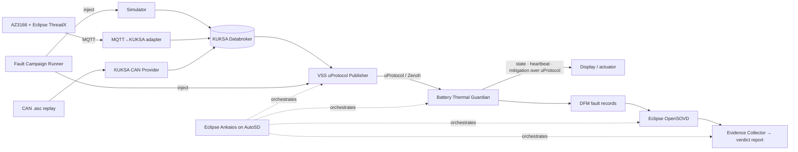

<!-- Made with Claude (Claude Code, Anthropic) -->
# RoM — Battery Thermal Guardian

Sensor / simulator → KUKSA Databroker → VSS uProtocol Client → (uProtocol over Zenoh) → Guardian → display.
The guardian never reads the databroker directly. Everything runs in Docker; you only need `docker compose` and `make`.

## Repository layout

Every component is its own pip package; services that run under Ankaios have their own image
(`services/<name>/Dockerfile` → `localhost/rom/<name>:dev`, no bind mounts, env-only config).

| Path | Package | Image | What |
|---|---|---|---|
| `libs/rom-common` | `rom_common` | – | contracts, config, JSON logging, KUKSA / MQTT helpers |
| `libs/rom-uprotocol` | `rom_uprotocol` | – | uProtocol library: Zenoh transport, URIs, publisher, subscriber |
| `services/vss-uprotocol-client` | `vss_uprotocol_client` | ✅ | KUKSA Databroker → uProtocol |
| `services/guardian` | `guardian` | ✅ | Battery Thermal Guardian (uProtocol input; display command out over MQTT) |
| `services/simulator` | `simulator` | dev image | 4-cell sine-wave temperature into KUKSA, with HTTP fault injection |
| `services/adapter` | `adapter` | dev image (`make hw`) | MQTT → KUKSA |
| `services/fault-injector` | `fault_injector` | ✅ | Fault Campaign Runner: YAML campaigns → simulator / publisher fault APIs |
| `services/dfm` | `dfm` | ✅ TODO | Diagnostic Fault Manager |
| `services/opensovd` | – | ✅ TODO | Eclipse OpenSOVD server |
| `services/evidence-collector` | `evidence_collector` | ✅ TODO | Evidence Collector → verdicts |
| `MXChip/AZ3166` | – (C firmware) | – | AZ3166 board on Eclipse ThreadX: sensor telemetry over MQTT, guardian state on its OLED |

## Quick start

```bash
make guardian                    # databroker + simulator + vss-uprotocol-client + guardian, shows guardian logs
SIM_PERIOD_S=30 make guardian    # faster wave (30 s instead of 120 s)
make down                        # stop everything
```

`Ctrl+C` only stops following the logs; the stack keeps running until `make down`.

## All commands

| Command | What it does |
|---|---|
| `make help` | list all commands |
| `make up` | start databroker + mosquitto in the background |
| `make guardian` | databroker + simulator + vss-uprotocol-client + guardian, follow guardian logs |
| `make images` | build all service images `localhost/rom/<service>:dev` |
| `make hw` | hardware run: AZ3166 → mosquitto → adapter → databroker → vss-uprotocol-client → guardian (no simulator), follow adapter + guardian logs |
| `make adapter` | MQTT → KUKSA adapter in the foreground |
| `make sim` | sine-wave simulator into KUKSA (foreground) |
| `make campaigns` | list the bundled fault campaigns |
| `make campaign C=thermal_runaway` | run a fault campaign against the running stack (`make guardian` first) |
| `make sim-up` | databroker + simulator in the background |
| `make kuksa` | interactive kuksa-client shell (`getValue Vehicle.Powertrain.TractionBattery.Temperature.Max`) |
| `make logs` | follow databroker, mosquitto and simulator logs |
| `make test` | run all tests (`libs/`, `services/`) in the dev image |
| `make shell` | bash inside the Python image |
| `make down` | stop everything |

## Without Docker (local Python)

```bash
make venv && . .venv/bin/activate     # every package installed editable (requirements.txt)

rom-guardian                 # offline test scenario, no broker needed
rom-simulator                # sine wave into KUKSA (needs the databroker: make up)
vss-uprotocol-client         # KUKSA -> uProtocol over Zenoh
rom-guardian --uprotocol     # live, reads uProtocol
rom-up-monitor               # print every uProtocol message on the battery topic
pytest -q
```

## Settings (env variables)

| Variable | Default | Used by |
|---|---|---|
| `KUKSA_HOST` / `KUKSA_PORT` | `127.0.0.1` / `55555` | all |
| `MQTT_HOST` / `MQTT_PORT` | `localhost` / `1883` | all |
| `SIM_HZ`, `SIM_PERIOD_S`, `SIM_MIN_C`, `SIM_MAX_C`, `SIM_SEED` | `2`, `120`, `30`, `69`, `0` | simulator |
| `SIM_API_HOST` / `SIM_API_PORT` | `127.0.0.1` / `8080` | simulator fault API (`0` = off) |
| `FAULT_API_HOST` / `FAULT_API_PORT` | `127.0.0.1` / unset (off) | vss-uprotocol-client transport-fault API |
| `SIMULATOR_URL` / `PUBLISHER_URL` | `http://127.0.0.1:8080` / – | fault-injector |
| `WARN_C`, `CRIT_C` | `38`, `45` | guardian |
| `STALE_MS`, `STUCK_S`, `MIN_PLAUSIBLE_C`, `MAX_PLAUSIBLE_C` | `2000`, `10`, `-40`, `150` | guardian (`STALE_MS` is also the uProtocol TTL) |
| `VSS_SOURCE_PATH` | `Vehicle.Powertrain.TractionBattery.Temperature.Max` | vss-uprotocol-client |
| `UP_AUTHORITY`, `UP_TRANSPORT`, `ZENOH_MODE`, `ZENOH_CONNECT`, `ZENOH_LISTEN` | `rom-vehicle`, `zenoh`, `peer`, –, – | vss-uprotocol-client, guardian |

## Fault injection

The simulator writes **four battery cells** (`Vehicle.Powertrain.TractionBattery.Cells.Cell1..4.Temperature`, a custom
overlay in [`infra/vss/rom_cells.json`](infra/vss/rom_cells.json) that the databroker loads next to the standard VSS)
and `Temperature.Max` = the hottest cell written. The guardian still sees only `Max`.

Faults are injected into the running stack over HTTP, by hand or by the Fault Campaign Runner:

```bash
make guardian                                   # stack up; fault APIs on 127.0.0.1:8080 (simulator) and :8081 (publisher)
make campaigns                                  # bundled campaigns
make campaign C=thermal_runaway                 # run one; watch the guardian state change in the guardian logs
curl -XPOST localhost:8080/faults -d '{"type":"stuck","cell":1}'      # or by hand
curl -XDELETE localhost:8080/faults
```

| Where | Faults | Docs |
|---|---|---|
| simulator | signal: stuck · spike · drift · out_of_range, source: dropout · replay_interruption | [`services/simulator`](services/simulator/README.md) |
| vss-uprotocol-client | transport: drop · reorder · duplicate · delay | [`services/vss-uprotocol-client`](services/vss-uprotocol-client/README.md) |
| fault-injector | YAML campaigns: hazard, safety goal, faults, expected state, `max_detect_ms`, seed | [`services/fault-injector`](services/fault-injector/README.md) |

The control APIs have **no authentication**; compose publishes them on `127.0.0.1` only. Do not expose them on a
shared network.

## Guardian states

`CLEAR` (no data yet) → `MONITORING` → `WARNING` (≥ `WARN_C`) → `CRITICAL` (≥ `CRIT_C`) → `MITIGATING`
(→ `CRITICAL` "mitigation failed" if still hot after 5 s). `SENSOR_FAULT` if the signal is stale (2 s),
stuck (10 s) or out of range (−40…150 °C).

## AZ3166 hardware node: sensor telemetry over MQTT

This section covers the working hardware node built on the **MXChip AZ3166 IoT DevKit**, running **Eclipse ThreadX / NetX Duo**. The board reads its onboard sensors, shows them on its OLED screen, and publishes them to an MQTT broker so any laptop on the hackathon network can pull live readings without touching the hardware.

Code lives under [`MXChip/AZ3166`](MXChip/AZ3166) and is based on [eclipse-threadx/samplex](https://github.com/eclipse-threadx/samplex). See [`MXChip/AZ3166/README.md`](MXChip/AZ3166/README.md) for the original toolchain/cloning instructions (ARM GCC, CMake, Ninja, submodules).

### What's in `MXChip/AZ3166`

- **`starter` app** — connects to Wi-Fi, reads the four onboard sensors (temperature/humidity, pressure, accelerometer, magnetometer) every 2 seconds, prints them over the serial console (115200 baud) and renders them in a small 6x8 font on the OLED screen.
- **`mqtt` app** — same sensors, but it follows the RoM sensor contract (`libs/rom-common/rom_common/contracts.py`): every 500 ms it publishes a JSON message with the temperature on `rom/sensor/battery/temp` (QoS 0), and it keeps `rom/sensor/battery/status` (`online` / `offline`, QoS 1, retained; `offline` is the MQTT Last Will) up to date. Publishing anything to the board's `ThreadXAZ3166/incoming` topic still triggers an immediate extra message. This is the one running for the hackathon demo.
  - **Guardian state on the OLED:** it subscribes to `rom/actuator/display/cmd` (QoS 1, retained; published by `services/guardian`) and shows state, `temp_c` and reason on the lower three lines. Invalid commands are ignored, and with no command for 5 seconds it shows `G:NO LINK`.
  - **Reconnects by itself:** if the broker goes away the board keeps retrying (1, 2, 4, 8, then every 10 s), and on reconnect it restores the Last Will, publishes `online` again and re-subscribes, so telemetry and the display resume without a reset.
- Two small fixes worth knowing about if you touch this code:
  - `ssd1306_conf.h`: enabled the `Font_6x8` tiny font (it ships disabled) so four sensor lines fit on the 128x64 OLED at once.
  - Standard `printf`/`snprintf` on this target are built without float support (newlib-nano). Any `%f` formatting must go through nanoprintf's own `npf_snprintf` (`#include "nanoprintf.h"`) instead — see `app/starter/main.c` and `app/mqtt/telemetry.c`.

### Building and flashing

```bash
cd MXChip/AZ3166
git submodule update --init   # fetches threadx + netxduo if you haven't already
bash scripts/build.sh starter   # or: bash scripts/build.sh mqtt
```

Wi-Fi credentials are never committed. For the `mqtt` app, create a git-ignored `MXChip/AZ3166/app/mqtt/cloud_config_local.h` next to `cloud_config.h` with your own values:

```c
#define WIFI_SSID     "your-ssid"
#define WIFI_PASSWORD "your-password"
```

Also set the IP of your broker (`MQTT_LOCAL_BROKER_IP`) in `cloud_config.h` (use your laptop's LAN IP; do not commit environment-specific values). For the `starter` app, fill in `app/starter/cloud_config.h` locally and do not commit it.

The ThreadX / NetX Duo submodules are pinned to known-working revisions (newer 6.5.x-era revisions fail DHCP with this WICED stack). Do not update them.

Flashing is drag-and-drop: the board mounts as a USB mass storage drive. Copy the built binary onto it:

```bash
cp build/app/mxchip_threadx.bin /media/<you>/AZ3166/
```

The board resets and runs the new firmware automatically. Note: after a flash, the drive sometimes remounts read-only (the host sees the mid-flash USB disconnect as an I/O error). Remount it before copying again:

```bash
udisksctl unmount -b /dev/sda && udisksctl mount -b /dev/sda
```

Serial console (boot log, sensor prints): `/dev/ttyACM0` (or the equivalent serial port on your OS) at 115200 baud, e.g. `screen /dev/ttyACM0 115200`.

### Setting up the MQTT broker

Any Mosquitto broker on the hackathon LAN works. Example on Linux:

```bash
sudo tee /etc/mosquitto/conf.d/hackathon.conf > /dev/null <<'CONF'
listener 1883 0.0.0.0
allow_anonymous true
CONF
sudo systemctl restart mosquitto
```

This opens the broker to every device on the network with no authentication — fine for a short-lived hackathon LAN, not for anything you'd leave running afterwards.

### Pulling sensor data from your own laptop

Once the `mqtt` app is flashed and connected, anyone on the same Wi-Fi can read live sensor data — no cables, no pairing.

**Connection details** (adjust the host to whatever the broker's actual LAN IP is):

| | |
|---|---|
| Broker host | `<broker-lan-ip>` |
| Port | `1883` (no auth) |
| Sensor topic | `rom/sensor/battery/temp` (QoS 0) |
| Status topic | `rom/sensor/battery/status` (QoS 1, retained: `online` / `offline`) |
| Request topic | `ThreadXAZ3166/incoming` (optional, on demand) |

**1. Install an MQTT client**

| OS | Command |
|---|---|
| macOS | `brew install mosquitto` |
| Linux / WSL | `sudo apt install mosquitto-clients` |
| Windows | `winget install EclipseMosquitto` |

**2. Watch the live feed** — prints a new message every 500 ms:

```bash
mosquitto_sub -h <broker-lan-ip> -t "rom/sensor/battery/#" -v
```

Example output:

```
rom/sensor/battery/status online
rom/sensor/battery/temp {"device_id":"az3166-01","seq":64,"ts_ms":1791305613274,"temp_c":28.75}
rom/sensor/battery/temp {"device_id":"az3166-01","seq":65,"ts_ms":1791305613794,"temp_c":28.75}
```

`seq` starts at 1 after every boot; `ts_ms` is epoch milliseconds once the board has synced time over SNTP (uptime milliseconds before that, which the adapter treats as "no latency info"); `temp_c` is the board's onboard temperature sensor, standing in for the battery temperature. If the board drops off the network the broker publishes the retained `offline` status within about 15 seconds.

**3. Ask for an extra message on demand** — publish anything to the request topic and the board sends one more message immediately, instead of waiting for the next 500 ms tick:

```bash
mosquitto_pub -h <broker-lan-ip> -t "ThreadXAZ3166/incoming" -m "get"
```

**4. Prefer a GUI?** Install [MQTT Explorer](https://mqtt-explorer.com), add a connection with the broker host above, port `1883`, no credentials, then expand the `rom/sensor/battery` topic tree. Readings update live as a tree view — no commands needed.

**If nothing comes through:** confirm you're on the same Wi-Fi as the broker (both the 2.4GHz and 5GHz bands of the same AP usually reach it) and that the host IP above is still current — if the broker runs on someone's laptop, a DHCP lease change will move it.

## Roadmap

**Idea:** a portable *Safety Evidence Factory* around the Battery Thermal Guardian. Every injected fault
must leave a traceable trail: **hazard → safety goal → injected fault → detection → mitigation → verdict**.

### Target architecture



### Done

- [x] KUKSA Databroker + simulator as the nominal signal source
- [x] VSS uProtocol Publisher (Zenoh transport following the current up-spec)
- [x] Guardian consumes VSS **only via uProtocol** — never reads the Databroker
- [x] Guardian state machine: CLEAR → MONITORING → WARNING → CRITICAL → MITIGATING, plus SENSOR_FAULT (stale / stuck / out of range)
- [x] MQTT → KUKSA adapter with contract validation and sequence-gap detection
- [x] Eclipse ThreadX firmware on AZ3166 publishing sensor telemetry over MQTT
- [x] Containerized dev stack, `make` shortcuts, unit tests per component
- [x] uProtocol extracted into a reusable library (`libs/rom-uprotocol`); every component is its own pip package, services have their own image (ready for Ankaios)
- [x] Placeholder services with their own images: DFM, OpenSOVD, Evidence Collector (build, start, log `not_implemented`)
- [x] Simulator with 4 battery cells (custom VSS overlay) and runtime fault injection over HTTP
- [x] Fault Campaign Runner: YAML campaigns with a seed, signal / source / transport faults, `run_id` on every log line
- [x] Guardian logs the uProtocol `msg_id` / `seq` that caused each state change
- [x] AZ3166 firmware reconnects to the MQTT broker automatically (Last Will `offline`, retained `online`)

### Next

#### 1. Sources
- [x] Bring the ThreadX firmware into `main` and align it with the sensor contract — real hardware end-to-end
- [ ] KUKSA CAN Provider with `.asc` replay as an additional source
- [x] Guardian state shown on the device display (display command over MQTT, `G:NO LINK` after 5 s)

#### 2. Fault campaigns
- [x] Fault Campaign Runner: campaigns described in YAML with a seed (deterministic, replayable); it drives the simulator and the uProtocol publisher over HTTP
- [x] Transport faults: delay · duplicate · drop · reorder
- [x] Signal faults: stuck · spike · drift · out-of-range
- [x] Source faults: dropout · replay interruption
- [x] Combined multi-fault scenarios (one campaign, more can be added as YAML)
- [ ] Campaigns for duplicate / reorder once the guardian detects them (Guardian section)

#### 3. Guardian
- [ ] Publish state, heartbeat, fault and mitigation events over uProtocol
- [ ] Detect duplicate / reordered messages and implausible rate of change
- [ ] Correlation IDs (`run_id`, uProtocol `msg_id`) on every event

#### 4. Diagnostics
- [ ] DFM fault records for every faulted scenario
- [ ] Expose diagnostics through Eclipse OpenSOVD
- [ ] Diagnostic faults: delayed DFM write · partial OpenSOVD visibility

#### 5. Evidence & verdicts
- [ ] Hazard and safety-goal catalog linked to each campaign
- [ ] Evidence Collector correlating campaign → events → diagnostics
- [ ] Verdict per run: PASS / FAIL / INCONCLUSIVE, with detection latency and mitigation timing
- [ ] Report covering all campaigns, failed scenarios included

#### 6. Orchestration & platform
- [ ] Eclipse Ankaios manages the final orchestrated run
- [ ] Run the stack on Eclipse AutoSD
- [ ] Remote reruns (Eclipse openDUT) with verdict consistency check

#### 7. Blueprint & community
- [ ] Reusable package another team can run with one command
- [ ] CI pipeline running tests and campaigns on every PR
- [ ] Upstream contribution: update `up-transport-zenoh-python` to zenoh 1.x and the current up-spec
- [ ] SDV Blueprint proposal

### How we work

GitHub Issues per roadmap item · feature branches · PRs with one reviewer · CI on every PR ·
JSON logs with correlation IDs as the raw material for evidence.
