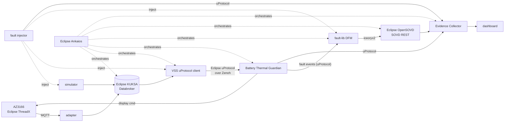

<!-- Made with Claude (Claude Code, Anthropic) -->
# RoM: Battery Thermal Guardian

**Eclipse SDV Hackathon Chapter Four · Doctor Whodunit challenge**

[](https://github.com/Eclipse-SDV-Hackathon-Chapter-Four/RoM/actions/workflows/ci.yml)


> A battery cell reports 200 °C. **Is it a thermal runaway, a broken sensor, or a broken link?**
> RoM tells them apart, names the component that failed, records it as a standard diagnostic trouble code (DTC) in
> Eclipse OpenSOVD, and **proves** every reaction with an automated, reproducible verdict.

```
hazard  →  injected fault  →  detection  →  mitigation  →  DTC in OpenSOVD  →  verdict (PASS / FAIL / INCONCLUSIVE)
```

## Highlights

|  |  |
|---|---|
| 🔍 **Whodunit** | Heartbeats along the chain (uProtocol link, KUKSA databroker, producer, chip); the guardian blames the failure closest to it and raises its own DTC (`databroker_down`, `chip_silent`, …) |
| 🌡️ **4-cell guardian** | `MONITORING → WARNING → CRITICAL → MITIGATING`; a stuck, stale or implausible cell is left out, so a bad sensor never disarms the warning or fakes an overheat |
| 🩺 **Standard diagnostics** | Fault events → Eclipse fault-lib DFM → Eclipse OpenSOVD (SOVD REST, ISO 17978), with environment data and the uProtocol `msg_id` of the message that caused it |
| 🧪 **22 fault campaigns** | YAML, seeded, replayable: signal, source, transport, heartbeat and diagnostics faults, each linked to a hazard and safety goal |
| ✅ **Evidence, not claims** | The Evidence Collector judges every run against the safety case (12 hazards, 9 safety goals, 11 requirements) and writes a checksummed evidence bundle (SHA-256 manifest) |
| 🚀 **One command** | `make final-run`: Eclipse Ankaios starts the whole stack, runs every campaign and collects the verdicts |
| 🔌 **Real hardware** | MXChip AZ3166 on Eclipse ThreadX as cell 1, guardian state back on its OLED |

## Architecture



The guardian never reads the databroker directly: everything it knows arrives over uProtocol.

### Eclipse SDV projects and where they run

| Project | Used for | Where |
|---|---|---|
| **Eclipse KUKSA** Databroker | VSS signal store, 4-cell VSS overlay | [`infra/vss`](infra/vss/rom_overlay.json), [`infra/docker-compose.yml`](infra/docker-compose.yml) |
| **Eclipse uProtocol** (+ **Eclipse Zenoh**) | every message between components, Python ↔ Rust | [`libs/rom-uprotocol`](libs/rom-uprotocol), [`services/dfm`](services/dfm) |
| **Eclipse OpenSOVD** (opensovd-core, fault-lib) | DTC storage (`dfm_bin`) and SOVD `faults` API | [`services/dfm`](services/dfm), [`services/opensovd`](services/opensovd) |
| **Eclipse Ankaios** | orchestrated final run of all services and campaigns | [`infra/ankaios`](infra/ankaios/README.md), [`scripts/final_run.sh`](scripts/final_run.sh) |
| **Eclipse ThreadX** (+ NetX Duo) | AZ3166 firmware: sensor telemetry, guardian state on the OLED | [`MXChip/AZ3166`](MXChip/AZ3166), [docs](docs/hardware-az3166.md) |
| **Eclipse Mosquitto** | MQTT between the board and the stack | [`infra/docker-compose.yml`](infra/docker-compose.yml) |

**Upstream:** opensovd-core does not implement the SOVD `faults` resource yet. Ours ([`faults.rs`](services/opensovd/src/faults.rs))
is offered on [opensovd-core#156](https://github.com/eclipse-opensovd/opensovd-core/issues/156#issuecomment-6044980574).

## Results

Final run under Eclipse Ankaios, all 22 campaigns (`make final-run`):

| | |
|---|---|
| Verdicts | **20 PASS**, 1 FAIL **on purpose** (`opensovd_partial_visibility`: a DTC is hidden from OpenSOVD, the collector must catch it), 1 FAIL fixed afterwards and PASS on rerun (`transport_delay`, [#29](https://github.com/Eclipse-SDV-Hackathon-Chapter-Four/RoM/issues/29)) |
| Safety goals covered | 9 / 9 |
| Detection, examples | out-of-range cell **385 ms** · late data rejected **1.7 s** · spike **414 ms** · lost producer heartbeat **1.9 s** · stuck sensor **10.5 s** (by design: `STUCK_S = 10`) |
| Tests | 340 Python tests + Rust tests, CI on every PR |

## Quick start

Only Docker and `make` are needed.

```bash
make images && make guardian       # whole stack; follows the guardian log (Ctrl+C detaches, stack keeps running)
make dashboard                     # second terminal → http://localhost:5173/#/live
make campaign C=thermal_runaway    # or pick a scenario in the dashboard
make sovd-faults                   # DTCs from Eclipse OpenSOVD
make down
```

| URL | What |
|---|---|
| `localhost:5173/#/live` · `#/evidence` | dashboard: live monitoring, run / stop scenarios, safety evidence |
| `localhost:8082/ui/` | Evidence Collector report |
| `localhost:7690/sovd/v1/apps/battery_guardian/faults` | OpenSOVD faults |

Full run under Ankaios (needs podman + Ankaios ≥ 1.0, about 25 min): `make final-run` → `runs/<id>/` with verdicts, summary,
evidence bundle and logs. Real board: `make hw`, or the **Cell 1** switch on the dashboard (AZ3166 sensor or simulator,
never both) ([hardware guide](docs/hardware-az3166.md)).
Dashboard, demo script and troubleshooting: [`services/dashboard`](services/dashboard/README.md).

## How the guardian decides

**States:** `CLEAR` → `MONITORING` → `WARNING` (≥ 38 °C) → `CRITICAL` (≥ 45 °C) → `MITIGATING` (cooling requested;
back to `CRITICAL` "mitigation failed" if still hot after 5 s). `SENSOR_FAULT` when no cell can be trusted or a heartbeat is lost.

**Per cell:** stale (2 s), stuck (10 s), out of range (−40…150 °C), implausible rate of change, duplicated / reordered
messages. A bad cell raises its own DTC (`cellN.signal_stuck`, …) and is left out; the other cells keep the pack monitored.

**Whodunit, which part of the chain broke:**

```
board ─MQTT─▶ adapter ─┐
                       ├─▶ KUKSA ─▶ vss-uprotocol-client ─uProtocol─▶ guardian
simulator ─────────────┘
```

| Heartbeat lost | Guardian says | DTC (`battery_guardian.…`) |
|---|---|---|
| `uprotocol` (the link) | `uP link lost` | `uprotocol_lost` |
| `databroker` (probe of KUKSA) | `KUKSA down` | `databroker_down` |
| `adapter` / `simulator` (producer) | `adapter down` / `sim down` | `adapter_down` / `simulator_down` |
| `chip` (board telemetry, MQTT Last Will) | `chip silent` | `chip_silent` |

When several are gone, the one closest to the guardian is blamed: it is the root cause, the rest are consequences.
Details: [`services/guardian`](services/guardian/README.md), [`docs/diagnostics-4-cells.md`](docs/diagnostics-4-cells.md).

## Fault campaigns

```bash
make campaigns                     # list
make campaign C=databroker_down    # run one against the running stack
curl -XPOST localhost:8080/faults -d '{"type":"stuck","cell":1}'    # or inject by hand
```

| Injected into | Faults |
|---|---|
| simulator (signal / source) | stuck · spike · drift · out_of_range · dropout · replay_interruption · heartbeat_loss |
| vss-uprotocol-client (transport) | drop · reorder · duplicate · delay · databroker_down |
| DFM (diagnostics) | write_delay · drop_write |

A campaign names its hazard, safety goal, expected state, expected (and tolerated) DTCs and a detection deadline:
[`services/fault-injector`](services/fault-injector/README.md). The control APIs have no authentication and listen on
`127.0.0.1` only.

## Repository layout

| Path | What |
|---|---|
| [`libs/rom-common`](libs/rom-common) | contracts, config, JSON logging, KUKSA / MQTT helpers |
| [`libs/rom-uprotocol`](libs/rom-uprotocol) | uProtocol library: Zenoh transport, URIs, publisher, subscriber |
| [`services/guardian`](services/guardian) | Battery Thermal Guardian |
| [`services/vss-uprotocol-client`](services/vss-uprotocol-client) | KUKSA → uProtocol, heartbeats, transport fault API |
| [`services/simulator`](services/simulator) | 4-cell temperature simulator, signal fault API, cooling actuator |
| [`services/adapter`](services/adapter) | MQTT → KUKSA for the AZ3166, chip heartbeat |
| [`services/fault-injector`](services/fault-injector) | Fault Campaign Runner + 22 bundled campaigns |
| [`services/dfm`](services/dfm) (Rust) | fault events → fault-lib `dfm_bin` |
| [`services/opensovd`](services/opensovd) (Rust) | Eclipse OpenSOVD server + SOVD `faults` resource |
| [`services/evidence-collector`](services/evidence-collector) | verdicts, safety case, evidence bundle, report |
| [`services/dashboard`](services/dashboard) | live dashboard and scenario control |
| [`MXChip/AZ3166`](MXChip/AZ3166) (C) | Eclipse ThreadX firmware |
| [`infra`](infra) | compose stack, Ankaios manifest, VSS overlay |

Every component is its own package; every service has its own image (`localhost/rom/<name>:dev`, env-only config).

<details>
<summary><b>All commands</b></summary>

| Command | What it does |
|---|---|
| `make help` | list all commands |
| `make mqtt-restart` | recreate mosquitto (fresh broker, host port 1883 re-published). `up`, `guardian`, `adapter` and `hw` do this first, so the broker is always reachable from the board and your laptop; it fails loudly if something else holds port 1883 |
| `make up` | start databroker + mosquitto in the background |
| `make guardian` | databroker + simulator + vss-uprotocol-client + guardian + dfm + opensovd, follow guardian logs |
| `make dfm-faults` | fault records in the running DFM as JSON |
| `make dfm-fixtures` | regenerate the DFM test fixtures for OpenSOVD (`services/dfm/fixtures`) |
| `make images` | build all service images `localhost/rom/<service>:dev` |
| `make hw` | hardware run: AZ3166 (= cell 1) → mosquitto → adapter → databroker → vss-uprotocol-client → guardian; the simulator fills cells 2-4 (`SIM_CELLS=2,3,4`); the guardian also expects the `adapter` and `chip` heartbeats. Follows adapter + guardian logs |
| `make adapter` | MQTT → KUKSA adapter in the foreground |
| `make sovd` | DFM + Eclipse OpenSOVD server in the background (SOVD REST on `localhost:7690/sovd`) |
| `make sovd-faults` | guardian faults from the DFM over SOVD |
| `make sim` | sine-wave simulator into KUKSA (foreground) |
| `make campaigns` | list the bundled fault campaigns |
| `make campaign C=thermal_runaway` | run a fault campaign against the running stack (`make guardian` first) |
| `make sim-up` | databroker + simulator in the background |
| `make kuksa` | interactive kuksa-client shell (`getValue Vehicle.Powertrain.TractionBattery.Temperature.Max`) |
| `make logs` | follow databroker, mosquitto and simulator logs |
| `make test` | run all tests (`libs/`, `services/`) in the dev image |
| `make shell` | bash inside the Python image |
| `make dashboard` / `make dashboard-stop` | dashboard dev server in Docker on `localhost:5173` (needs the stack from `make guardian`); stop it |
| `make evidence-snapshot` | save the collector's evidence as `runs/<timestamp>/` (gitignored) for the dashboard's Safety Evidence view, bundle verified |
| `make down` | stop everything |

</details>

<details>
<summary><b>Settings (env variables)</b></summary>

| Variable | Default | Used by |
|---|---|---|
| `KUKSA_HOST` / `KUKSA_PORT` | `127.0.0.1` / `55555` | all |
| `MQTT_HOST` / `MQTT_PORT` | `localhost` / `1883` | all |
| `MQTT_HOST_PORT` | `1883` | compose mosquitto host port (`make`) |
| `SIM_HZ`, `SIM_PERIOD_S`, `SIM_MIN_C`, `SIM_MAX_C`, `SIM_SEED` | `2`, `120`, `30`, `69`, `0` | simulator |
| `SIM_API_HOST` / `SIM_API_PORT` | `127.0.0.1` / `8080` | simulator fault API (`0` = off) |
| `FAULT_API_HOST` / `FAULT_API_PORT` | `127.0.0.1` / unset (off) | vss-uprotocol-client transport-fault API |
| `SIMULATOR_URL` / `PUBLISHER_URL` | `http://127.0.0.1:8080` / – | fault-injector |
| `UP_CAMPAIGN_EVENTS` | unset | fault-injector: `1` = campaign events over uProtocol for the evidence collector |
| `SOVD_URL`, `EVIDENCE_*` | see [`services/evidence-collector`](services/evidence-collector/README.md) | evidence-collector |
| `WARN_C`, `CRIT_C` | `38`, `45` | guardian |
| `STALE_MS`, `STUCK_S`, `MIN_PLAUSIBLE_C`, `MAX_PLAUSIBLE_C` | `2000`, `10`, `-40`, `150` | guardian (`STALE_MS` is also the uProtocol TTL) |
| `VSS_SOURCE_PATH` | `Vehicle.Powertrain.TractionBattery.Temperature.Max` | vss-uprotocol-client |
| `SIM_CELLS` | `1,2,3,4` | simulator (`2,3,4` when the real board is cell 1) |
| `SIM_COOLING`, `SIM_COOLING_C_PER_S`, `SIM_COOLING_RELAX_C_PER_S` | unset (compose: `1`), `3`, `0.2` | simulator as the cooling actuator: cells cool while the guardian is `MITIGATING` ([simulator](services/simulator/README.md#cooling-the-simulator-as-the-cooling-actuator)) |
| `ADAPTER_CELL` | `1` | adapter: which cell the board is |
| `ADAPTER_ENABLED`, `ADAPTER_API_PORT` | `1` (`make guardian`: `0`), compose `8084` | adapter: writes the board's readings or not; cell 1 source switch API (`POST /source`) |
| `HEARTBEAT_PERIOD_MS`, `HEARTBEAT_STALE_MS` | `500`, `1500` | client, adapter, simulator / guardian |
| `CHIP_TIMEOUT_MS` | `1500` | adapter: no telemetry for this long reports the chip heartbeat as 0 |
| `REQUIRED_HEARTBEATS` | `uprotocol,databroker` | guardian (`make hw`: `+adapter,chip`) |
| `UP_AUTHORITY`, `UP_TRANSPORT`, `ZENOH_MODE`, `ZENOH_CONNECT`, `ZENOH_LISTEN` | `rom-vehicle`, `zenoh`, `peer`, –, – | vss-uprotocol-client, guardian |

</details>

<details>
<summary><b>Without Docker (local Python)</b></summary>

```bash
make venv && . .venv/bin/activate     # every package installed editable (requirements.txt)

rom-guardian                 # offline test scenario, no broker needed
rom-simulator                # sine wave into KUKSA (needs the databroker: make up)
vss-uprotocol-client         # KUKSA -> uProtocol over Zenoh
rom-guardian --uprotocol     # live, reads uProtocol
rom-up-monitor               # print every uProtocol message on the battery topic
pytest -q
```

</details>

## Roadmap

**1. Sources**
- [x] KUKSA Databroker + 4-cell simulator with runtime fault injection
- [x] AZ3166 on Eclipse ThreadX end to end: telemetry in, guardian state on the OLED, automatic MQTT reconnect
- [ ] KUKSA CAN Provider with `.asc` replay ([#22](https://github.com/Eclipse-SDV-Hackathon-Chapter-Four/RoM/issues/22))

**2. Guardian**
- [x] State machine per cell, consumes VSS **only over uProtocol**
- [x] Heartbeats for link, databroker, producer and chip; names the failing component
- [x] Duplicate / reorder detection, implausible rate of change
- [x] Correlation ids (`run_id`, uProtocol `msg_id`) from sender to DTC to verdict
- [ ] The guardian's own outgoing heartbeat ([#23](https://github.com/Eclipse-SDV-Hackathon-Chapter-Four/RoM/issues/23))

**3. Diagnostics**
- [x] Fault events over uProtocol → fault-lib DFM (Python ↔ Rust)
- [x] SOVD `faults` resource on Eclipse OpenSOVD
- [x] Diagnostics faults: delayed DFM write, partial OpenSOVD visibility

**4. Fault campaigns & evidence**
- [x] 22 seeded YAML campaigns: signal, source, transport, heartbeat, diagnostics, combined
- [x] Safety case (hazard → goal → requirement → campaign), checked against every campaign
- [x] PASS / FAIL / INCONCLUSIVE per run with detection and mitigation timing; report + SHA-256 bundle
- [x] Dashboard: live monitoring, run / stop scenarios, safety evidence

**5. Orchestration & platform**
- [x] Eclipse Ankaios runs the final orchestrated run (`make final-run`)
- [ ] Run the stack on Eclipse AutoSD ([#24](https://github.com/Eclipse-SDV-Hackathon-Chapter-Four/RoM/issues/24))
- [ ] Remote reruns with Eclipse openDUT and a verdict consistency check ([#25](https://github.com/Eclipse-SDV-Hackathon-Chapter-Four/RoM/issues/25))

**6. Community**
- [x] CI on every PR: tests, DFM fixtures, images, campaigns end to end, ThreadX firmware
- [x] SOVD `faults` resource offered upstream ([opensovd-core#156](https://github.com/eclipse-opensovd/opensovd-core/issues/156#issuecomment-6044980574), follow-up [#28](https://github.com/Eclipse-SDV-Hackathon-Chapter-Four/RoM/issues/28))
- [ ] `up-transport-zenoh-python` on zenoh 1.x and the current up-spec ([#26](https://github.com/Eclipse-SDV-Hackathon-Chapter-Four/RoM/issues/26))
- [ ] SDV Blueprint proposal: Safety Evidence Factory ([#27](https://github.com/Eclipse-SDV-Hackathon-Chapter-Four/RoM/issues/27))

## How we worked

GitHub issue per roadmap item · feature branches · PRs with review · CI on every PR · JSON logs with correlation ids
as the raw material for evidence. Team: [@petarlazic04](https://github.com/petarlazic04) ·
[@djurovic04](https://github.com/djurovic04) · [@st4nkich](https://github.com/st4nkich) · [@codermery](https://github.com/codermery).

## Declaration: prepared code and AI assistance

- **Written during the hackathon (6–7 Oct 2026):** everything in this repository except the parts listed below.
- **Based on existing code:** the AZ3166 firmware starts from [eclipse-threadx/samplex](https://github.com/eclipse-threadx/samplex)
  (our changes: the `mqtt` app, sensor contract, OLED guardian state, reconnect); ThreadX and NetX Duo are pinned submodules.
- **Used as upstream dependencies, not forked:** Eclipse KUKSA Databroker (image), opensovd-core and fault-lib (crates,
  pinned revisions), up-transport-zenoh-rust, Eclipse Zenoh, Eclipse Ankaios, Eclipse Mosquitto.
- **AI assistance:** most of the code and documentation was written with **Claude Code** (Anthropic) using the
  **Claude Opus 5.5** model, steered and reviewed by the team; files carry a `Made with Claude` header. A few commits
  come from the GitHub Copilot agent.

## License

[Apache-2.0](LICENSE)
