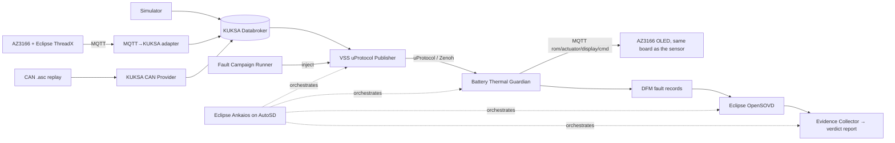

<!-- Made with Claude (Claude Code, Anthropic) -->
# RoM — Roadmap (Doctor Whodunit)

**Idea:** a portable *Safety Evidence Factory* around the Battery Thermal Guardian. Every injected fault
must leave a traceable trail: **hazard → safety goal → injected fault → detection → mitigation → verdict**.

## Architecture

Implemented today: the sensor path AZ3166 → MQTT → adapter → KUKSA → uProtocol → Guardian, and the display
feedback path Guardian → MQTT `rom/actuator/display/cmd` → AZ3166 OLED (the display command does **not** travel over
uProtocol). The Fault Campaign Runner, CAN provider, DFM, OpenSOVD, Evidence Collector and Ankaios are still planned.

## Done

- [x] KUKSA Databroker + simulator as the nominal signal source
- [x] VSS uProtocol Publisher (Zenoh transport following the current up-spec)
- [x] Guardian consumes VSS **only via uProtocol** — never reads the Databroker
- [x] Guardian state machine: CLEAR → MONITORING → WARNING → CRITICAL → MITIGATING, plus SENSOR_FAULT (stale / stuck / out of range)
- [x] MQTT → KUKSA adapter with contract validation and sequence-gap detection
- [x] Eclipse ThreadX firmware on AZ3166 publishing sensor telemetry over MQTT
- [x] ThreadX firmware integrated into `main` and aligned with the sensor contract (`rom/sensor/battery/temp`, retained status + Last Will), with automatic MQTT broker reconnect
- [x] Guardian state shown on the AZ3166 OLED (Guardian → MQTT `rom/actuator/display/cmd`)
- [x] Containerized dev stack, `make` shortcuts, unit tests per component
- [x] uProtocol extracted into a reusable library (`libs/rom-uprotocol`); every component is its own pip package, services have their own image (ready for Ankaios)

## Next

### 1. Sources
- [ ] KUKSA CAN Provider with `.asc` replay as an additional source

### 2. Fault campaigns
- [ ] Fault Campaign Runner inside the uProtocol publisher, campaigns described in YAML with a seed (deterministic, replayable)
- [ ] Transport faults: delay · duplicate · drop · reorder
- [ ] Signal faults: stuck · spike · drift · out-of-range
- [ ] Source faults: dropout · replay interruption
- [ ] Combined multi-fault scenarios

### 3. Guardian
- [ ] Publish state, heartbeat, fault and mitigation events over uProtocol
- [ ] Detect duplicate / reordered messages and implausible rate of change
- [ ] Correlation IDs (`run_id`, uProtocol `msg_id`) on every event

### 4. Diagnostics
- [ ] DFM fault records for every faulted scenario
- [ ] Expose diagnostics through Eclipse OpenSOVD
- [ ] Diagnostic faults: delayed DFM write · partial OpenSOVD visibility

### 5. Evidence & verdicts
- [ ] Hazard and safety-goal catalog linked to each campaign
- [ ] Evidence Collector correlating campaign → events → diagnostics
- [ ] Verdict per run: PASS / FAIL / INCONCLUSIVE, with detection latency and mitigation timing
- [ ] Report covering all campaigns, failed scenarios included

### 6. Orchestration & platform
- [ ] Eclipse Ankaios manages the final orchestrated run
- [ ] Run the stack on Eclipse AutoSD
- [ ] Remote reruns (Eclipse openDUT) with verdict consistency check

### 7. Blueprint & community
- [ ] Reusable package another team can run with one command
- [ ] CI pipeline running tests and campaigns on every PR
- [ ] Upstream contribution: update `up-transport-zenoh-python` to zenoh 1.x and the current up-spec
- [ ] SDV Blueprint proposal

## How we work

GitHub Issues per roadmap item · feature branches · PRs with one reviewer · CI on every PR ·
JSON logs with correlation IDs as the raw material for evidence.
